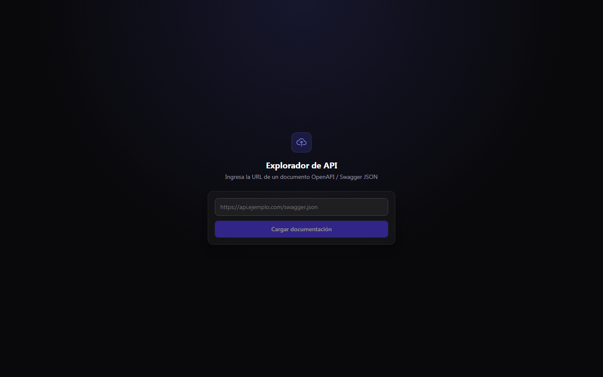
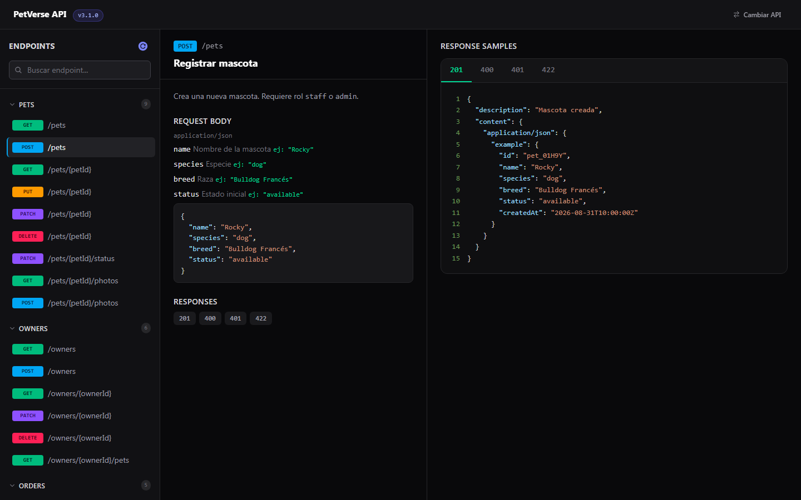
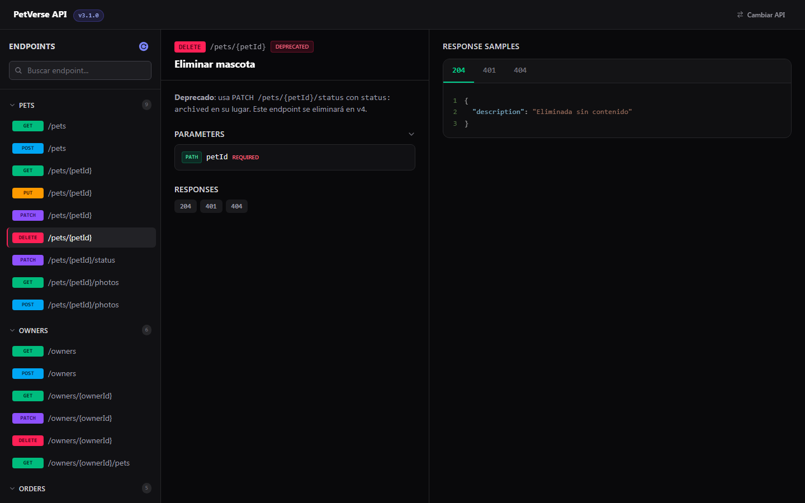
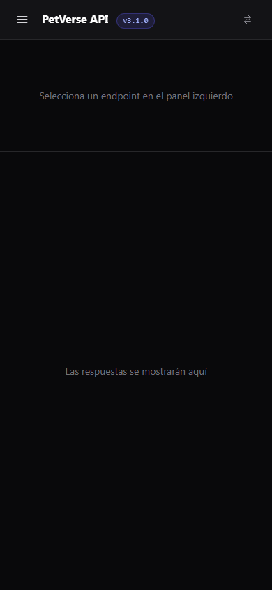
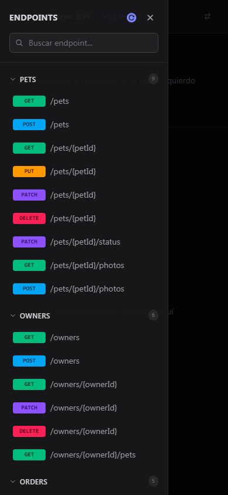
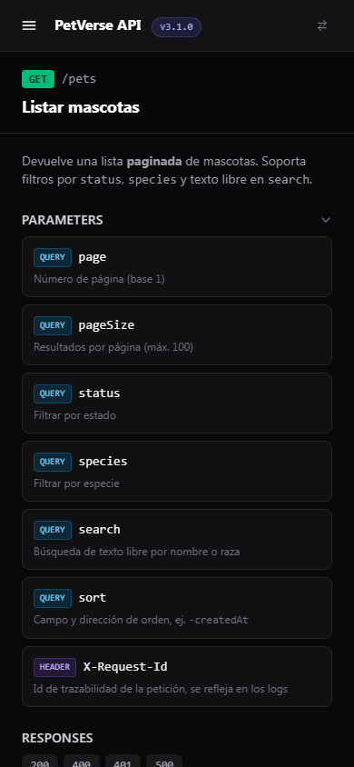
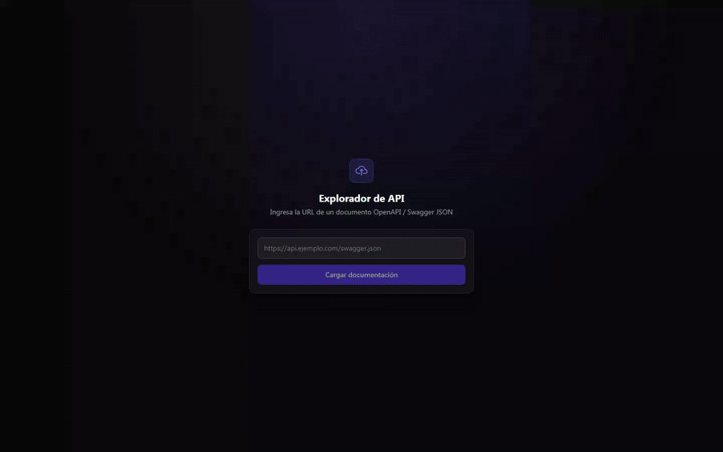

## AUTOR:

**Eder Llancari Guerra**

# 🔍 OpenAPI Explorer — README (Resumido)

[](LICENSE)[](https://react.dev/)[](https://tailwindcss.com/)[](https://www.framer.com/motion/)[](https://swagger.io/tools/swagger-ui/)

---

## 📖 Descripción breve

**OpenAPI Explorer** es una UI ligera para visualizar y navegar documentos **OpenAPI/Swagger**.  
Permite cargar un JSON desde una URL, explorar endpoints agrupados por tags, ver detalles (summary, descripción, parámetros, request body) y visualizar respuestas con resaltado de JSON y tabs por status code. Está diseñado con **React + TailwindCSS** y usa **Framer Motion** para animaciones suaves.

---

## 🧩 Objetivo de este README

Presentar el proyecto de forma clara en tu repositorio: qué hace, tecnologías, estructura y cómo **mostrar** o **presentar** el proyecto.

---

## 🚀 Tecnologías clave

- **React** (hooks)
- **TailwindCSS** (estilos)
- **Framer Motion** (animaciones)
- **Axios** (carga de JSON remoto)
- **react-markdown** (renderizar descripciones Markdown)
- **react-syntax-highlighter** (resaltar JSON)

---

## 📂 Estructura principal (resumen)

```
src/
 ├─ App.tsx                # Punto de entrada UI: carga JSON, estado global
 ├─ UrlLoader.tsx          # Input para la URL del OpenAPI JSON
 ├─ SidebarPaths.tsx       # Sidebar agrupando endpoints por tags
 ├─ TagGroup.tsx           # Lista de endpoints por tag
 ├─ EndpointDetails.tsx    # Muestra summary, description, params, request body
 ├─ Responses.tsx          # Pestañas y visualización de respuestas JSON
 ├─ interfaces/
 │    └─ swagger.interface.ts
```

---

## 🧭 Resumen de componentes y responsabilidades

- **App.tsx** — Controla la carga del JSON y el estado seleccionado (path + method).
- **UrlLoader** — Componente para ingresar la URL del OpenAPI/Swagger JSON.
- **SidebarPaths** — Agrupa los paths por `tag` y permite seleccionar un endpoint; incluye botón de recarga.
- **TagGroup** — Renderiza cada grupo (tag) y sus endpoints (path + método).
- **EndpointDetails** — Muestra summary, description (renderizado Markdown), parámetros (colapsables), request bodies y ejemplos con syntax highlight.
- **Responses** — Pestañas por status code y vista formateada del objeto `response` (con SyntaxHighlighter).

---

## 🖼 Demo (guía rápida)

1. Abre la aplicación (modo desarrollo o build) y muestra la pantalla principal.
2. Ingresa una **URL** de OpenAPI JSON (puede ser un ejemplo público).
3. En el sidebar selecciona un **endpoint**: muestra `EndpointDetails` (summary + Markdown) y luego `Responses`.
4. Muestra el botón **Reload** (recarga la misma URL) y cómo el icono indica actividad.

Si quieres mostrar código en el README, usa estos snippets (dentro del README real tus bloques de código se marcarán con `...` según tu preferencia):

---

### 🔹 Ejemplo de uso (fragmento de App.tsx — resumen funcional)

```tsx
// Extracto: manejar carga y reload
const handleLoadJson = async (url: string) => {
  setLoading(true);
  setError("");
  try {
    const res = await axios.get(url);
    setJsonData(res.data);
    setLastUrl(url);
  } catch (err: any) {
    setError(err.message || "Error al cargar el JSON");
  } finally {
    setLoading(false);
  }
};

const handleReload = async () => {
  if (lastUrl) await handleLoadJson(lastUrl);
};
```

---

### 🔹 Ejemplo visual (snippet para mostrar en README — contenedor con scroll)

```html
<div class="h-64 overflow-y-scroll scrollbar-thin scrollbar-rounded">
  <!-- Contenido desplazable (ej. lista de endpoints) -->
</div>
```

---

## 📌 Puntos fuertes para destacar en la presentación

- Carga dinámica de cualquier OpenAPI JSON por URL.
- Incluye `public/mock-api.json`, una API de ejemplo para probar el tema sin depender de una URL externa.
- Markdown en descripciones (negritas, listas, enlaces).
- Syntax highlighting para ejemplos JSON.
- UI compacta: sidebar (paths) — detalles — respuestas.
- Responsive: sidebar tipo drawer y paneles apilados en móvil, layout de 3 columnas en escritorio.
- Animaciones suaves para mejorar la experiencia.

---

## 📜 Licencia y créditos

- **Autor:** Eder Llancari Guerra
- **Licencia:** MIT — libre para uso, modificación y distribución.

---

## 🖼 Capturas

### Escritorio

| Pantalla de carga | Detalle de endpoint | Endpoint deprecado |
|---|---|---|
|  |  |  |

### Móvil

| Vista apilada | Sidebar tipo drawer | Detalle de endpoint |
|---|---|---|
|  |  |  |

## 🎬 Demo animado



*Colapsar/expandir parámetros, cambiar entre tabs de status code y colapsar un grupo de tags.*

---

## 📸 Regenerar capturas y GIF (`npm run capture`)

El proyecto incluye un comando que levanta la app, la navega con un
navegador headless y genera todo lo de arriba automáticamente en `media/`:

```bash
npm run capture
```

No hace falta tener `npm run dev` corriendo aparte — el script levanta su
propio servidor de Vite en el puerto 5183, carga `public/mock-api.json`
como datos de ejemplo, navega la UI y lo cierra todo al terminar.

**Qué instala y por qué:**

- [`playwright-core`](https://www.npmjs.com/package/playwright-core) — controla Chromium headless para tomar las capturas (desktop y móvil) y grabar el video de la demo. Usa el Chromium que ya tengas cacheado por Playwright; si no lo tienes, instálalo una vez con `npx playwright install chromium`.
- [`ffmpeg-static`](https://www.npmjs.com/package/ffmpeg-static) — binario de `ffmpeg` portable (sin instalación aparte en el sistema) usado para convertir el video grabado (`.webm`) a un GIF optimizado con paleta de colores.

El script vive en [`scripts/capture.mjs`](./scripts/capture.mjs) y es un buen punto de partida para agregar más pasos (otros endpoints, otro breakpoint, etc.).

---

## 🎥 Video de demo producido (Remotion)

Además de las capturas, el repo incluye un video de ~44s (intro animada,
recorrido por escritorio y móvil, outro) armado con
[Remotion](https://www.remotion.dev/) — renderiza React a video, con
transiciones de fade entre escenas y el material real de la app grabado
con Playwright.

```bash
npm run footage       # graba los clips reales (desktop + móvil) en video/public/footage/
npm run video:studio  # abre el editor visual de Remotion para iterar sobre las escenas
npm run video:render  # renderiza out/demo.mp4
```

**Estructura:**

```
video/
 ├─ index.ts, Root.tsx     # registro de la composición "Demo"
 ├─ Demo.tsx                # timeline: intro → clips → outro, con transiciones
 ├─ colors.ts, fonts.ts     # paleta (calcada del tema) y tipografía (Inter)
 ├─ components/
 │    ├─ BrowserFrame.tsx   # "ventana de navegador" que enmarca los clips de escritorio
 │    ├─ PhoneFrame.tsx     # silueta de teléfono para el clip móvil
 │    └─ Caption.tsx        # chip "01 · Título de la escena"
 └─ scenes/                 # Intro, Outro y las escenas que envuelven cada clip
```

**Qué instala y por qué (además de lo de `npm run capture`):**

- [`remotion`](https://www.npmjs.com/package/remotion) + [`@remotion/cli`](https://www.npmjs.com/package/@remotion/cli) — el motor que renderiza componentes React a video frame por frame.
- [`@remotion/transitions`](https://www.npmjs.com/package/@remotion/transitions) — las transiciones (fade) entre escenas.
- [`@remotion/google-fonts`](https://www.npmjs.com/package/@remotion/google-fonts) — autohostea la fuente Inter para el video sin depender de una CDN externa en tiempo de render.

**Notas si vas a regenerarlo:**

- `npm run footage` reencoda cada clip grabado a MP4 (H.264, framerate constante) con `ffmpeg-static` antes de guardarlo — Remotion no maneja bien el VP8/framerate variable que produce Playwright directamente (error *"No frame found at position..."*).
- `npm run video:render` usa `--concurrency=1` a propósito: con concurrencia por defecto, extraer frames en paralelo del mismo clip disparaba ese mismo error de forma intermitente. Es más lento pero confiable.
- Si vuelves a grabar el material y las duraciones de los clips cambian, ajusta las constantes al inicio de [`video/Demo.tsx`](./video/Demo.tsx) (hay un comentario con las duraciones esperadas de cada clip).

---
